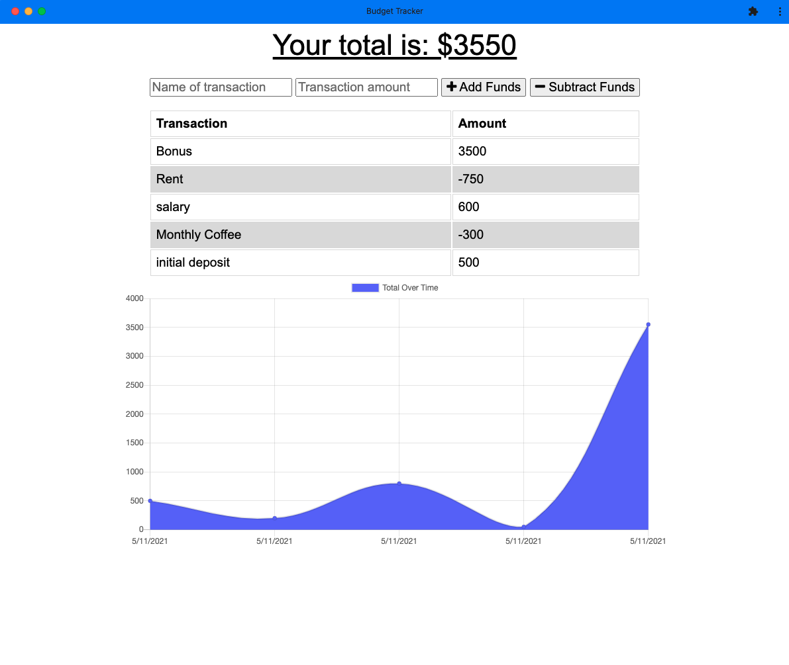

# Budget Tracker Online PWA
  -- Zack Campbell
  
  

  ## Description
  A PWA that tracks your budget with credits and withdrawls, and displays each item persistantly using indexedDB and MongoDB. Even when offline you can view cached transactions and add new transactions to the app which will be updated when network connection is restored.
  
  ## Table of Contents 
  - [Installation](#installation)
  - [Usage](#usage)
  - [Screenshot](#screenshot)
  - [Credits](#credits)
  - [License](#license)
  - [Contributing](#contributing)
  - [Tests](#tests)
  
  ## Installation
  not a ton of instructions. Becuase it's a PWA you can install the app if you want (check chrome documentation if you would like to see how to do that).

  [LINK TO THE APP.](https://evening-eyrie-91137.herokuapp.com/)
  ## Usage
  opefully actual app usage is pretty straight forward, your interaction will primarily be on the front end in browser. If you are interested making further development changes, feel free to do so, you will need to use mongodb and and the seed files provided in the repo.

  ## Screenshot
  
  ## Credits
  None (Yet)
  ## License
 The MIT License

  ---
  
  ## Contributing
  As outlined by the license feel free to contribute and if you want, send pull requests and I'll look to implement. Thanks!
  ## Tests
  None